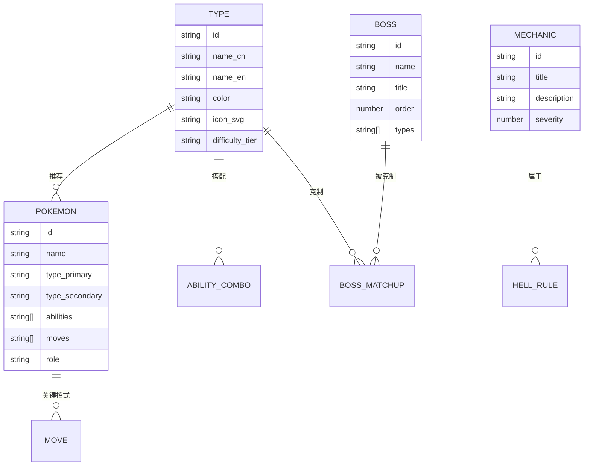

# 宝可梦 Elite Redux 2.65 · 地狱难度全属性通关网站 技术架构

## 1. 架构设计

纯前端单页应用（SPA），无后端服务。所有攻略数据通过本地 TypeScript 数据文件提供。

```mermaid
flowchart TB
    subgraph "前端层 Frontend"
        "React 18 + TypeScript"
        "React Router DOM"
        "TailwindCSS"
        "Zustand 状态管理"
    end
    subgraph "数据层 Data"
        "typesData.ts 18属性数据"
        "hellMechanics.ts 地狱机制"
        "bossesData.ts 馆主与天王"
        "pokemonData.ts 推荐宝可梦"
    end
    subgraph "渲染层 Render"
        "Canvas 火焰粒子背景"
        "SVG 18属性徽章"
        "CSS Grid 像素网格"
    end
    "前端层" --> "数据层"
    "前端层" --> "渲染层"
```

## 2. 技术说明

- **前端**：React@18 + TypeScript + tailwindcss@3 + vite
- **初始化工具**：vite-init（react-ts 模板）
- **后端**：无
- **数据库**：无，全部使用本地静态数据
- **状态管理**：Zustand（管理当前选中的属性、滚动锚点）
- **路由**：react-router-dom v6
- **图标**：lucide-react
- **特殊渲染**：
  - 首页 HERO 火焰粒子使用原生 Canvas API（性能优于第三方库）
  - 18 属性徽章使用内联 SVG（可染色、可悬停动画）
  - 相克矩阵使用 CSS Grid + 颜色插值

## 3. 路由定义

| 路由 | 用途 |
|------|------|
| `/` | 首页：HERO、改版介绍、难度对比、18 属性入口 |
| `/hell-mode` | 地狱难度详解：11 项机制、流程时间线、资源限制 |
| `/types` | 全属性通关：属性轮盘 + 详情面板 + 相克矩阵 |
| `/types/:typeId` | 跳转到指定属性详情（如 `/types/fire`） |

## 4. API 定义
无后端，不涉及 API。

## 5. 服务端架构图
不适用，纯前端部署。

## 6. 数据模型

### 6.1 数据模型定义



### 6.2 数据定义语言
不使用 SQL，数据以 TypeScript 文件形式组织：

- `src/data/types.ts`：18 个属性对象，含 id/name_cn/name_en/color/icon/difficulty_tier
- `src/data/pokemon.ts`：每属性 3 只推荐宝可梦，含能力/招式
- `src/data/bosses.ts`：馆主与四天王列表（按流程顺序）
- `src/data/mechanics.ts`：HELL MODE 11 项机制
- `src/data/typeChart.ts`：18×18 相克矩阵（0/0.5/1/2 四档）

### 6.3 关键性能要点
- HERO 火焰粒子 canvas 在移动端禁用（通过 `window.matchMedia` 检测）
- 18 属性徽章 SVG 内联打包，避免额外请求
- 相克矩阵使用 CSS Grid 而非表格，避免重排
- 所有静态数据使用 ES Module 直接 import，无需运行时 fetch
